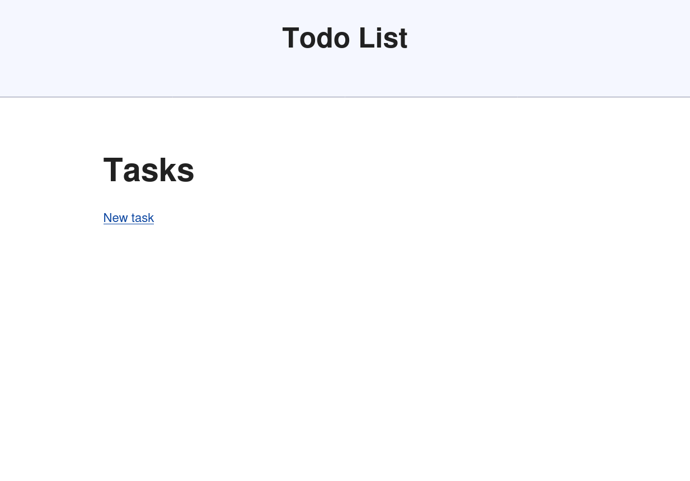

# Todo

This sample application was built to provide a playground for trying out the
different capabilities of the Rails Hotwire framework to support single page
application behavior. The `main` branch of this repository will include the
finished application and updates. Other branches will contain partially
completed updates. These partially completed branches will enable following
a tutorial and provide check points.

The tutorial is based on a blog post entitled [Hotwire: Supercharged Rails forms with Turbo by Alex Chevez.](https://medium.com/@alexischvez/hotwire-supercharged-rails-forms-with-turbo-6de79bb9e374)

# New Rails App
This application was started with Rails 7.1.3.2 and Ruby 3.3.1. We opted _not_
to use the testing framework, but use Rspec instead. This intial setup is found
in the `rails-devcontainer` branch. As you might guess from the branch name,
we also setup a **devcontainer** and VSCode extensions. The application was
created with:
```
rails new todo -T
```
The `-T` removes the testing boilerplate. We added the `rspec` gem to the
`Gemfile` and ran:
```
 rails generate rspec:install
 ```

# Todo Scaffold
The scaffolded todo list is created and configured as part of the `todo-scaffold`
branch. You can execute the commands in this section _after checking out_ a
copy of the `rails-devcontainer` branch, if you want to follow along in the
tutorial.
```
git checkout rails-devcontainer
git switch -c tutorial
```

The commands for setting up the tutorial application and scaffold for the
Todo List are sown below:
```
bin/rails g scaffold tasks description:string
bin/rails db:migrate
```

Now we want to update the `routes.db` file to point the root route to the
list of tasks:
```
tasks#index
```

Now we'll setup a [Simple CSS](https://github.com/kevquirk/simple.css) and
the layout page for our little application. To do this, we will need to update
the `app/views/layout/application.rb` file. Add the:
```
<link rel="stylesheet" href="https://cdn.simplecss.org/simple.min.css">
```
to the `<head>` section of the file. I then add a header tag to title the
applciation
```
<header>
  <h2>Todo List</h2>
</header>
```
After saving this file, you should be able to fire up the application by using:
```
$ bin/rails s
=> Booting Puma
=> Rails 7.1.3.2 application starting in development
=> Run `bin/rails server --help` for more startup options
Puma starting in single mode...
* Puma version: 6.4.2 (ruby 3.3.1-p55) ("The Eagle of Durango")
*  Min threads: 5
*  Max threads: 5
*  Environment: development
*          PID: 21691
* Listening on http://127.0.0.1:3000
* Listening on http://[::1]:3000
Use Ctrl-C to stop
```

Your application should like the following:

